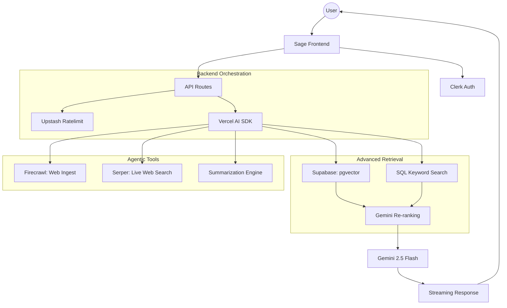

# Sage 🌿 - Agentic RAG Workspace 🚀

An advanced, production-grade AI Research Assistant built with **Next.js 15**, **Vercel AI SDK**, and **Google Gemini**. Sage goes beyond basic "Chat with PDF" applications by implementing a multi-stage hybrid search pipeline and autonomous agentic behavior.

![Project Preview]


## ✨ Key Features

### 1. Multi-Source Ingestion

* **PDF Intelligence**: High-accuracy text extraction and semantic chunking of PDF documents.
* **Web Ingestion (Firecrawl)**: Full-page content extraction from any URL using the **Firecrawl** API.
* **Native Notes**: Create, edit, and chat with local text notes stored in your knowledge base.

### 2. Advanced Retrieval Pipeline

* **Hybrid Search**: Combines **Vector Similarity** (semantic) with **Keyword Matching** (exact) for maximum recall.
* **LLM Re-ranking**: Uses **Gemini 2.5 Flash** to score retrieved chunks for relevance, significantly improving answer quality.
* **Context Optimization**: Automatic de-duplication and smart-trimming of content to fit the model's most effective context window.

### 3. Agentic Capabilities (Tools)

Sage intelligently orchestrates multi-step tasks using its internal toolset:

* **`summarizeDocument`**: Recursive summarization of long-form content.
* **`compareDocuments`**: Side-by-side analysis and contrast of multiple sources.
* **`extractInsights`**: Cross-source synthesis to find high-level themes and action items.
* **`webSearch` (Serper)**: Live internet access to fact-check data or retrieve current events using the **Serper** API.

### 4. Professional UX

* **Real-time Streaming**: Instant feedback using Vercel AI SDK's streaming protocol.
* **Markdown Rendering**: Rich text formatting for lists, code, and headers.
* **Dynamic Citations**: Transparent source badges linking answers back to the original documentation.
* **Premium Aesthetics**: Built with Tailwind CSS 4, Shadcn UI, and Liquid Metal shaders.

## 🛠 Tech Stack

* **Framework**: Next.js 15 (App Router)
* **AI Engine**: Vercel AI SDK (v6), Google Gemini 2.5 Flash
* **Embeddings**: Google `text-embedding-004`
* **Search**: Supabase (PostgreSQL + `pgvector`), Hybrid Retrieval logic
* **ORM**: Prisma (PostgreSQL on Neon)
* **Auth**: Clerk (Enterprise-grade security)
* **External APIs**: Firecrawl (Web scraping), Serper (Live search)
* **Caching/Rates**: Upstash Redis & Ratelimit
* **Styling**: Tailwind CSS 4, Lucide Icons, Framer Motion

## 🏗 System Architecture



## 🚀 Installation & Setup

### 1. Clone & Install

```bash
git clone https://github.com/yourusername/sage-ai.git
cd sage-ai
npm install
```

### 2. Configure Environment Variables

Create a `.env` file in the root:

```env
# Clerk Authentication
NEXT_PUBLIC_CLERK_PUBLISHABLE_KEY=...
CLERK_SECRET_KEY=...

# AI & Search APIs
GOOGLE_GENERATIVE_AI_API_KEY=...
SERPER_API_KEY=...
FIRECRAWLER_API_KEY=...

# Database & Storage
DATABASE_URL=...
SUPABASE_URL=...
SUPABASE_ANON_KEY=...

# Upstash Redis
UPSTASH_REDIS_REST_URL=...
UPSTASH_REDIS_REST_TOKEN=...
```

### 3. Database Sync

```bash
npx prisma generate
npx prisma db push
```

### 4. Launch

```bash
npm run dev
```
